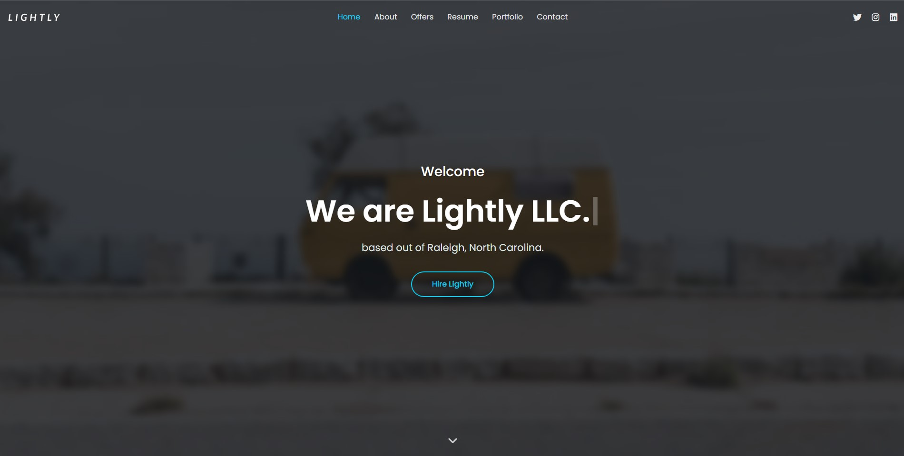

# Lightly LLC

### Description
This front-end web application built with React.js is the business site of Lightly LLC.
### License

This application is licensed under MIT

### Application Demo

### Table of Contents
- [Description](#description)
- [Contributing](#contributing)
- [Tests](#tests)
- [Questions?](#questions)

### Contributing
- [Casey Chamberlain](https://github.com/KCaseyChamberlain)

### Tests
N/A

### Questions
GitHub Username: (kcaseychamberlain) 

View the project in GitHub at: https://github.com/LightlyDev/lightly

View the application live hosted at: https://www.elightly.com

If you have any questions, contact Casey at: lightlydev.com